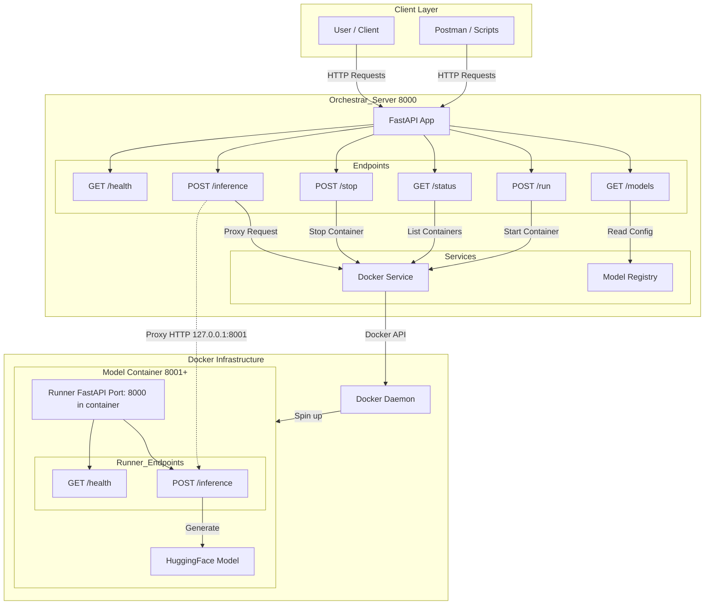

# Orchestrar SLM Server

A local Orchestrator Server to manage and deploy Small Language Models (SLMs) in isolated Docker containers.

## Features

- **Model Registry**: Manage models via `config/models.yaml`.
- **Docker Isolation**: Each model runs in its own container.
- **REST API**: List, start, stop, and query models.
- **On-demand Loading**: Models are started only when requested.

## Prerequisites

- Docker Engine installed and running.
- Python 3.9+

## Setup

1.  **Install Dependencies**:

    ```bash
    pip install -r requirements.txt
    ```

2.  **Build Runner Image**:
    The server uses a generic runner image. Build it first:

    ```bash
    docker build -t orchestrar-runner:latest runner/
    ```

3.  **Configure Models**:
    Edit `config/models.yaml` to add your HuggingFace models.

## Usage

1.  **Start the Server**:

    ```bash
    uvicorn app.main:app --reload
    ```

2.  **API Endpoints**:
    - `GET /models`: List available models.
    - `POST /run`: Start a model container.
      ```json
      { "model_id": "tiny-llama" }
      ```
    - `GET /status`: Check running models.
    - `POST /inference`: Run inference.
      ```json
      { "model_id": "tiny-llama", "prompt": "Hello" }
      ```
    - `POST /stop`: Stop a model container.

## Architecture



- **Orchestrator**: FastAPI app managing the lifecycle.
- **Runner**: A separate Docker image (`orchestrar-runner`) that loads the model using `transformers` and exposes an internal API.
